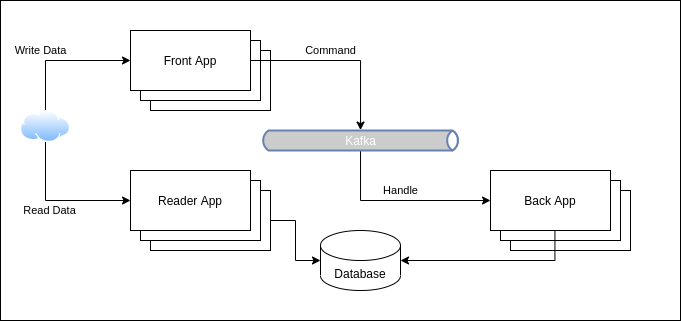
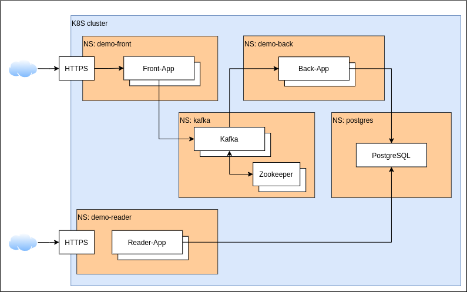

# SRE Coding Challenge

You are tasked with deploying a solution to Kubernetes cluster. You may use Minikube, Microk8s, k3s or any other Kubernetes distribution  
Solution consists of 3 SpringBoot applications, Kafka deployment to support messaging and PostgreSQL database to provide persistence layer.
Application deployment should use helm (https://helm.sh/), Kafka and Postgres may be deployed with any technology you like.

We do not expect too much automation (few bash scripts should work just fine). In case you prefer to automate everything, 
you may use any flavour of automation tools, Ansible, Terraform - everything will work, You may even setup CI/CD flow using Jenkins/Tekton/Drone/etc. ;)

## Overall architecture



## Deployment layout



## Kafka Topic specs

- name: testCommand
- partitions: 32
- replication-factor: 1

## Database

Application developed with PostgreSQL 11.5

Database schema created with Back application first run

## Applications

### Build applications

You need Java 11+ installed, then run

`./gradlew clean build`

to build applications. Jar files will land in `app/back/build/libs/back-0.1.0.jar` (Back app for instance)

### Hints

Few hints to simplify application deployment.

Docker:
`ENTRYPOINT ["java", "-jar", "/app.jar"]`

SpringBoot additional config arg if needed. Additional config values will override default.
`--spring.config.additional-location=path-to-additional-config`

Health check exposed as 
`http://localhost:{management.server.port}/health`

Applications expose API management interface as
`http://localhost:{server.port}/swagger-ui.html`

### Front

Sample application configuration `application.yaml` file

```yaml
server.port: 8080
################### Kafka ##############################
spring:
  kafka:
    bootstrap-servers:  {{ kafka-bootstrap-goes here }}

################### Logging settings ###################
logging:
  level:
    root: WARN
    db.demo: INFO

management.server.port: 8081
```

### Back

Sample application configuration `application.yaml` file

```yaml
spring:
  kafka:
    bootstrap-servers: {{ kafka-bootstrap-goes here }}
  datasource.url: jdbc:postgresql://localhost:5432/postgres
  datasource.username: {{ username }}
  datasource.password: {{ password }}

management.server.port: 8081
```

Hint: 
You may use Spring Boot relaxed binding to pass parameters through environment variables
https://docs.spring.io/spring-boot/docs/2.1.8.RELEASE/reference/html/boot-features-external-config.html#boot-features-external-config-relaxed-binding

`SPRING_DATASOURCE_USERNAME=postgres`

### Reader

Sample application configuration `application.yaml` file

```yaml
spring:
  datasource.url: jdbc:postgresql://localhost:5432/postgres
  datasource.username: {{ username }}
  datasource.password: {{ password }}

management.server.port: 8081
```